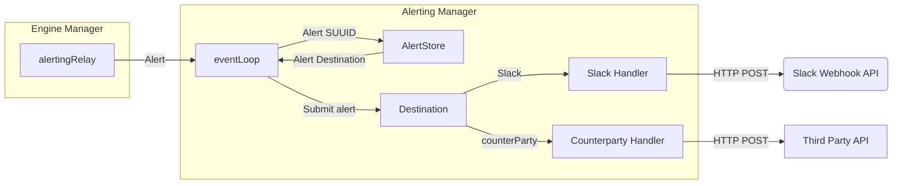

# Alerting

## Overview
The alerting subsystem will receive alerts from the `EngineManager` and publish them to the appropriate alerting destinations. The alerting subsystem will also be responsible for managing the lifecycle of alerts. This includes creating, updating, and removing alerting entries for invariant sessions.

## Diagram


### Alert
An `Alert` type stores all necessary metadata for external consumption by a downstream entity. 
### Alert Store
The alert store is a persistent storage layer that is used to store alerting entries. As of now, the alert store only supports configurable alert destinations for each alerting entry. Ie:
```
    (SUUID) --> (AlertDestination)
```

### Alert Destinations
An alert destination is a configurable destination that an alert can be sent to. As of now this only includes _Slack_. In the future however, this will include other third party integrations.

#### Slack
The Slack alert destination is a configurable destination that allows alerts to be sent to a specific Slack channel. The Slack alert destination will be configured with a Slack webhook URL. The Slack alert destination will then use this URL to send alerts to the specified Slack channel.

**NOTE: As of now Pessimism can only post alerts to a single slack channel**

### Cooldown
**NOTE: This is currently unimplemented**
To ensure that alerts aren't spammed to destinations once invoked, a time based cooldown value should exist that specifies how long an invariantSession must wait before it can propagate a trigged alert again. This value should be configurable by the user via a JSON-RPC request.