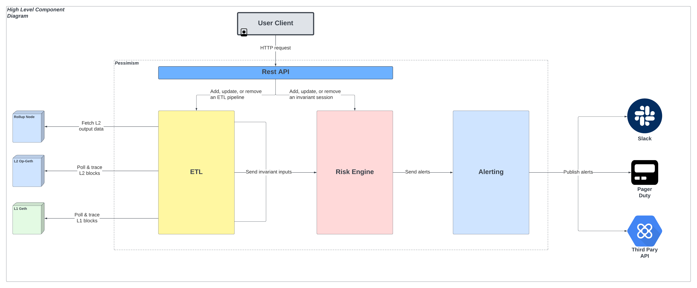

# Pessimism Architecture

## Overview
There are *three subsystems* that drive Pessimism’s architecture:
1. [ETL](./etl.md) - Modularized data extraction system for retrieving and processing external chain data in the form of a DAG known as the Pipeline DAG
2. [Risk Engine](./engine.md) - Logical execution platform that runs a set of invariants on the data funneled from the Pipeline DAG
3. [Alerting](./alerting.md) - Alerting system that is used to notify users of invariant failures

These systems will be accessible by a client through the use of a JSON-RPC API that has unilateral access to all three primary subsystems.

The API will be supported to allow Pessimism users via client to:
1. Start invariant sessions
2. Update existing invariant sessions
3. Remove invariant sessions

## Diagram
The following diagram illustrates the core interaction flow between the three primary subsystems, API, and external data sources:

## Shared State
To provide context about specific data values (ie. addresses to monitor) between subsystems, Pessimism uses a shared state store. The shared state store will be a non-persistent storage layer. This means that the data will not be persisted to disk and will be lost upon restart of the Pessimism service.

**NOTE: As of now, the shared state store only supports an in-memory representation and fails to leverage more proper cache solutions like Redis**
