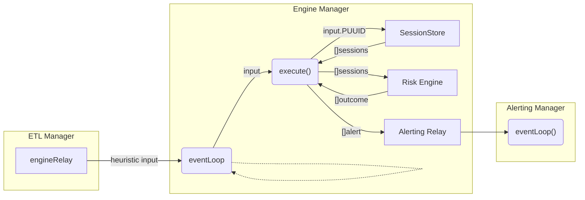

# Risk Engine

## Overview
The Risk Engine is responsible for handling and executing active heuristics. It is the primary downstream consumer of ETL output. The Risk Engine will receive data from the ETL and execute the heuristics associated with the data. If an invalidation occurs, the Risk Engine will return an `InvalidationOutcome` to the `EngineManager`. The `EngineManager` will then create an `Alert` using the `InvalidationOutcome` and publish it to the Alerting system.

The Risk Engine will execute the heuristics associated with some ingested input data and return an `InvalidationOutcome` to the `EngineManager`. The `EngineManager` will then create an `Alert` using the `InvalidationOutcome` and publish it to the Alerting system.

The following diagram further exemplifies this key interaction:


## Inter-Connectivity
The ETL publishes `Heuristic Input` to the Risk Engine using a relay channel. The Risk Engine will subscribe to this channel to receive and process updates as they are published by the ETL. The Risk Engine will also publish events to the Alerting system using a separate downstream relay channel. The Alerting system will subscribe to this channel to receive and process updates as they are published by the Risk Engine.

## Heuristic Session
An heuristic session refers to the execution and representation of a single heuristic. An heuristic session is uniquely identified by a `SUUID` and is associated with a single `PUUID`. An heuristic session is created by the `EngineManager` when a user requests to run an active session. The `EngineManager` will create a new `HeuristicSession` and pass it to the `RiskEngine` to be executed. The `RiskEngine` will then execute the heuristic session and return an `InvalidationOutcome` to the `EngineManager`. The `EngineManager` will then create an `Alert` using the `InvalidationOutcome` and publish it to the Alerting system.

## Session UUID (SUUID)
The SUUID is a unique identifier that is used to identify a specific heuristic session. The SUUID is generated by the `EngineManager` when a user requests to run a new heuristic session. The SUUID is used to uniquely identify a specific heuristic session. This allows the `EngineManager` to perform operations on a specific heuristic session such as removing it or updating it. 

A `SUUID` constitutes of both a unique `UUID` and a `PID`. 

A `SessionPID` is encoded using the following 3 byte array sequence:
```
            0           1           2           3
            |-----------|-----------|-----------|
               network    pipeline    heuristic
                type        type        type
```

## Heuristic Input
The heuristic input is a struct that contains the following fields:
* `PUUID` - The ID of the heuristic that the input data is intended for
* `Input` - Transit data that was generated by the ETL

## Heuristic
An heuristic is a logical execution module that defines some set of invalidation criteria. The heuristic is responsible for processing the input data and determining if an invalidation has occurred. If an invalidation has occurred, the heuristic will return a `InvalidationOutcome` that contains relevant metadata necessary for the `EngineManager` to create an `Alert`.

### Hardcoded Base Heuristic
Every hardcoded heuristic must implement an `Heuristic` interface to be compatible for invalidation by the `Hardcoded` Risk Engine type. Currently the interface is as follows:
```
type Heuristic interface {
	Addressing() bool
	InputType() core.RegisterType
	Invalidate(core.TransitData) (*core.InvalOutcome, bool, error)
	SUUID() core.SUUID
	SetSUUID(core.SUUID)
}

``` 

### Heuristic Input Type
The heuristic input type is a `RegisterType` that defines the type of data that the heuristic will receive as input. The heuristic input type is defined by the `InputType()` method of the `Heuristic` interface. The heuristic input type is used by the `RiskEngine` to determine if the input data is compatible with the heuristic. If the input data is not compatible with the heuristic, the `RiskEngine` will not execute the heuristic and will return an error.

### Addressing
All heuristics have a boolean property `Addressing` which determines if the heuristic is addressable. To be addressable, an heuristic must only execute under the context of a single address.

For example, a `balance_enforcement` heuristic session will be addressable because it only executes invalidation logic for the native ETH balance of a single address. 

### Heuristic States
State is used to represent the current state of an heuristic. The state of an heuristic is represented by a `HeuristicState` type. The following states are supported:
- `Running` - The heuristic is currently running and is being executed by the `RiskEngine`
- `Inactive` - The heuristic is currently inactive and is not being executed by the `RiskEngine`
- `Paused` - The heuristic is currently paused and is not being executed by the `RiskEngine`

### Execution Type
A risk engine has an associated execution type that defines how the risk engine will execute the heuristic. There are two types of execution:
1. `Hardcoded` - The heuristic invalidation logic is hardcoded directly into the risk engine registry using native Go code. These heuristics can only be changed by modifying the application source code of the engine registry.
2. `Dynamic` - The heuristic invalidation logic is dynamically loaded and executed by a risk engine. These heuristics can be changed without modifying the application source code of the engine registry.
**As of now, this is not supported.**

## Hardcoded Heuristic Types
As of now, there are two types of hardcoded heuristics that a user can deploy active sessions for:
-  `invocation` - Heuristic that is triggered when a specific smart contract function is invoked **Not currently supported**
- `balance_enforcement` - Heuristic that checks an address's balance changes and ensures that the balance does not exceed a certain threshold

### How to add a new heuristic
1. Create a new file in the `internal/engine/registry` directory that stores the heuristic implementation. The implementation must adhere to the interface specified for the `BaseHeuristic` type. 

3. Add a new entry to the `HeuristicType` enum in `internal/core/constants.go`
2. Add a new entry to the registry in `internal/engine/registry/registry.go`

## Dynamic Heuristic Types
**Not currently supported**
Dynamic heuristics are programmable entities that can be deployed as arbitrary code by a user. They are represented via some code standard that is dynamically executable by a Risk Engine. Unlike `Hardcoded` heuristics, dynamic heuristics can be deployed and executed without modifying the source code of the Pessimism application.
