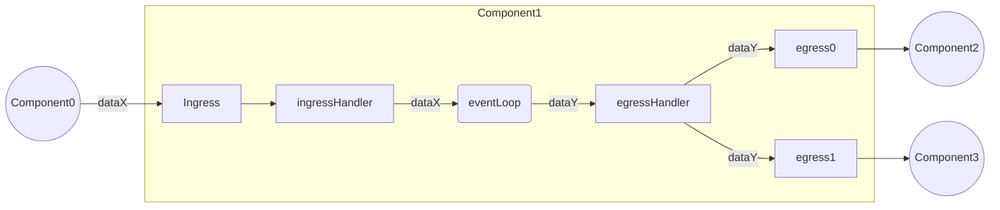
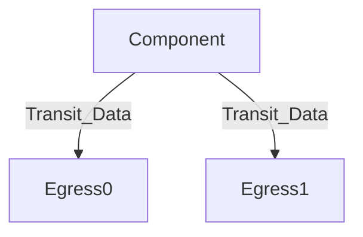
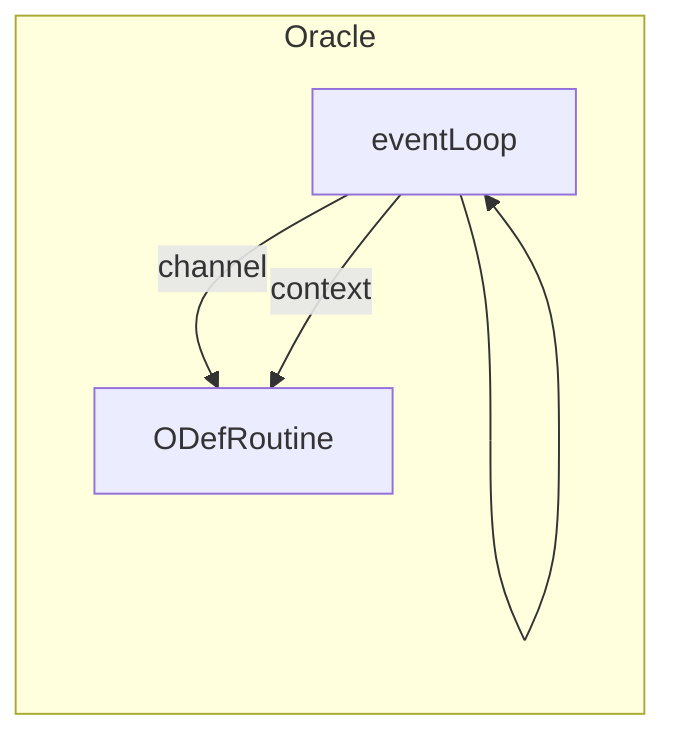
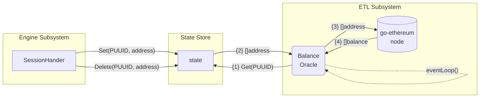
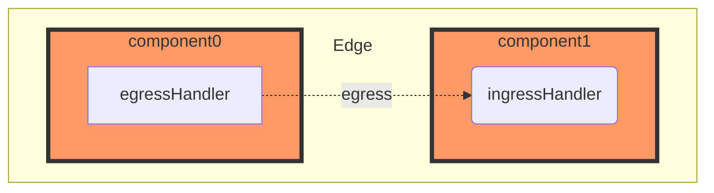

# ETL
The Pessimism ETL is a generalized abstraction for a DAG-based component system that continuously transforms chain data into inputs for consumption by a Risk Engine in the form of intertwined data “pipelines”. This DAG based representation of ETL operations is done to ensure that the application can optimally scale to support many active invariants. This design allows for the reuse of modularized ETL components and de-duplication of conflicting pipelines under certain key logical circumstances. 

## Component
A component refers to a graph node within the ETL system. Every component performs some operation for transforming data from any data source into a consumable input for the Risk Engine to ingest. 
Currently, there are three total component types:
1. `Pipe` - Used to perform local arbitrary computations _(e.g. Extracting L1Withdrawal transactions from a block)_
2. `Oracle` - Used to poll and collect data from some third-party source _(e.g. Querying real-time account balance amounts from an op-geth execution client)_
3. `Aggregator` - Used to synchronize events between asynchronous data sources _(e.g. Synchronizing L1/L2 blocks to understand real-time changes in bridging TVL)_
 
### Inter-Connectivity 
The diagram below showcases how interactivity between components occurs:



#### Egress Handler
All component types use an `egressHandler` struct for routing transit data to actively subscribed downstream ETL components.


#### Ingress Handler
All component types also use an `ingressHandler` struct for ingesting active transit data from upstream ETL components.

### Component UUID (CUUID)
All components have a UUID that stores critical identification data. Component IDs are used by higher order abstractions to:
* Represent a component DAG 
* Understand when component duplicates occur in the system

Component UUID's constitute of both a randomly generated `UUID` and a deterministic `PID`. This is done to ensure uniqueness of each component instance while also ensuring collision based properties so that components can be reused when viable.

A `ComponentPID` is encoded using the following four byte sequence:
```
            0        1        2        3        4
            |--------|--------|--------|--------|
             network  pipeline component register
             id         type     type      type
```

### State Update Handling
**NOTE - State handling policies by management abstractions has yet to be properly fleshed out**

### Pipe
Pipes are used to perform arbitrary transformations on some provided upstream input data. 
Once input data processing has been completed, the output data is then submitted to its respective destination(s). 

#### Attributes
* An `ActivityState` channel with a pipeline manager
* Ingress handler that other components can write to
* `TransformFunc` - A processing function that performs some data translation/transformation on respective inputs
* An `egressHandler` that stores dependencies to write to (i.e. Other pipeline components, invariant engine)
* A specified output data type

#### Example Use Case(s)
* Generating opcode traces for some EVM transaction
* Parsing emitted events from a transaction 

### Oracle 
Oracles are responsible for collecting data from some external third party _(e.g. L1 geth node, L2 rollup node, etc.)_. As of now, oracle's are configurable through the use of a standard `OracleDefinition` interface that allows developers to write arbitrary oracle logic. 
The following key interface functions are supported/enforced:
* `ReadRoutine` - Routine used for reading/polling real-time data for some arbitrarily configured data source
* `BackTestRoutine` - _Optional_ routine used for sequentially backtesting from some starting to ending block heights. 

Unlike other components, `Oracles` actually employ _2 go routines_ to safely operate. This is because the definition routines are run as a separate go routine with a communication channel to the actual `Oracle` event loop. This is visualized below:



#### Attributes
* A communication channel with the pipeline manager
* Poller/subscription logic that performs real-time data reads on some third-party source
* An `egressHandler` that stores dependencies to write to (i.e. Other pipeline components, invariant engine)
* A specified output data type

* _(Optional)_ Interface with some storage (postgres, mongo, etc.) to persist lively extracted data
* _(Optional)_ Backtest support for polling some data between some starting and ending block heights
* _(Optional)_ Use of an application state cache to understand which parameter sets to sequentially feed to an endpoint


#### Example Use Case(s)
* Polling layer-2 block data in real-time for state updates
* Interval polling user provided chain addresses for native ETH amounts

### (TBD) Aggregator
**NOTE - This component type is still in-development**
Aggregators are used to solve the problem where a pipe or an invariant input will require multiple sources of data to perform an execution sequence. Since aggregators are subscribing to more than one data stream with different output frequencies, they must employ a synchronization policy for collecting and propagating multi-data inputs within a highly asynchronous environment.

#### Attributes
* Able to read heterogenous transit data from an arbitrary number of component ingresses
* A synchronization policy that defines how different transit data from multiple ingress streams will be aggregated into a collectivly bound single piece of data
* EgressHandler to handle downstream transit data routing to other components or destinations

#### Single Value Subscription
_Only send output at the update of a single ingress stream_

Single Value Subscription refers to a synchronization policy where a bucketed multi-data tuple is submitted every time there’s an update to a single input data queue.

For example we can have an invariant that subscribes to blocks from two heterogenous chains (layer1, layer2) or `{ChainA, ChainB}`, let's assume `BLOCK_TIME(ChainA)> BLOCK_TIME(ChainB)`.

We can either specify that the invariant will run every-time there's an update or a new block from `ChainA`:
```
{
   "A:latest_blocks": [xi] where cardinality = 1,
   "B:latest_blocks": [yj, ..., yn] where cardinality >= 1,
}

```

 Or we can specify the inverse, every-time there's a new block from `ChainB`:
```
{
   "A:latest_blocks": [NULL OR xi] where cardinality <= 1,
   "B:latest_blocks": [yj] where cardinality = 1,
}
```

This should be extendable to any number of heterogenous data sources.


## Registry
A registry submodule is used to store all ETL data register definitions that provide the blueprint for a unique ETL component type. A register definition consists of:
- `DataType` - The output data type of the component node. This is used for data serialization/deserialization by both the ETL and Risk Engine subsystems.
- `ComponentType` - The type of component being invoked (_e.g. Oracle_). 
- `ComponentConstructor` - Constructor function used to create unique component instances. All components must implement the `Component` interface.
- `Dependencies` - Ordered slice of data register dependencies that are necessary for the component to operate. For example, a component that requires a geth block would have a dependency list of `[geth.block]`. This dependency list is used to ensure that the ETL can properly construct a component graph that satisfies all component dependencies. 

## Addressing
Some component's require knowledge of a specific address to properly function. For example, an oracle that polls a geth node for native ETH balance amounts would need knowledge of the address to poll. To support this, the ETL leverages a shared state store between the ETL and Risk Engine subsystems.

Shown below is how the ETL and Risk Engine interact with the shared state store using a `BalanceOracle` component as an example:



### Geth Block Oracle Register
A `GethBlock` register refers to a block output extracted from a go-ethereum node. This register is used for creating `Oracle` components that poll and extract block data from a go-ethereum node in real-time.

### Geth Account Balance Oracle Register
An `AccountBalance` register refers to a native ETH balance output extracted from a go-ethereum node. This register is used for creating `Oracle` components that poll and extract native ETH balance data for some state persisted addreses from a go-ethereum node in real-time.
Unlike, the `GethBlock` register, this register requires knowledge of an address set that's shared with the risk engine to properly function and is therefore addressable. Because of this, any invariant that uses this register must also be addressable.

## Managed ETL

### Component Graph
The ETL uses a `ComponentGraph` construct to represent and store critical component inter-connectivity data _(ie. component node entries and graph edges)_.

A graph edge is represented as a binded communication path between two arbitrary component nodes (`c1`, `c2`). Adding an edge from some component (`c1`) to some downstream component (`c2`) results in `c1` having a path to the ingress of `c2` in it's [egress handler](#egress-handler). This would look something like:



**NOTE:** The component graph used in the ETL is represented as a _DAG_ (Directed Acyclic Graph), meaning that no bipartite edge relationships should exist between two components (`c1`, `c2`) where `c1-->c2` && `c2-->c1`. While there are no explicit checks for this in the code software, it should be impossible given that all components declare entrypoint register dependencies within their metadata, meaning that a component could only be susceptible to bipartite connectivity in the circumstance where a component registry definition declares inversal input->output of an existing component. 


### Pipeline
Pipelines are used to represent some full component path in a DAG based `ComponentGraph`. A pipeline is a sequence of components that are connected together in a way to express meaningful ETL operations for extracting some invariant input for consumption by the Risk Engine.

### Pipeline States
- `Backfill` - Backfill denotes that the pipeline is currently performing a backfill operation. This means the pipeline is sequentially reading data from some starting height to the most recent block height. This is useful for building state dependendent pipelines that require some knowledge of prior history to make live assessments. For example, detecting imbalances between the native ETH deposit supply on the L1 portal contract and the TVL unlocked on the L2 chain would require indexing the prior history of L1 deposits to construct correct supply values. 
- `Live` - Live denotes that the pipeline is currently performing live operations. This means the pipeline is reading data from the most recent block height.
- `Stopped` - Stopped denotes that the pipeline is currently not performing any operations. This means the pipeline is neither reading nor processing any data.
- `Paused` - Paused denotes that the pipeline is currently not performing any operations. This means the pipeline is neither reading nor processing any data. The difference between `Stopped` and `Paused` is that a `Paused` pipeline can be resumed at any time while a `Stopped` pipeline must be restarted.
- `Error` - Error denotes that the pipeline is currently in an error state. This means the pipeline is neither reading nor processing any data. The difference between `Stopped` and `Error` is that a `Error` pipeline can be resumed at any time while a `Stopped` pipeline must be restarted.

### Pipeline Types
There are two types of pipelines:

**Live**
A live pipeline is a pipeline that is actively running and performing ETL operations on some data fetched in real-time. For example, a live pipeline could be used to extract newly curated block data from a go-ethereum node.


**Backtest**
A backtest pipeline is a pipeline that is used to sequentially backtest some component sequence from some starting to ending block height. For example, a backtest pipeline could be used to backtest a _balance_enforcement_ invariant between L1 block heights `0` to `1000`. 


### Pipeline UUID (PUUID)
All pipelines have a PUUID that stores critical identification data. Pipeline UUIDs are used by higher order abstractions to:
* Route invariant inputs between the ETL and Risk Engine
* Understand when pipeline collisions between `PIDs` occur

Pipeline UUID's constitute of both a randomly generated `UUID` and a deterministic `PID`. This is done to ensure uniqueness of each component instance while also ensuring collision based properties so that overlaping components can be deduplicated when viable. 

A `PipelinePID` is encoded using the following 9 byte array sequence:
```
            0        1                                        5                                        9
            |--------|----------------------------------------|----------------------------------------|
             Pipeline             first pipeline path               last pipeline path
             type                 component PID sequence            component PID sequence
```

### Collision Analysis
**NOTE - This section is still in-development**
Pipeline collisions occur when two pipelines with the same `PID` are generated. This can occur when two pipelines have identical component sequences and valid stateful properties.

For some pipeline collision to occur between two pipelines (`P0`, `P1`), the following properties must hold true:
1. `P0` must have the same `PID` as `P1`
2. `P0` and `P1` must be live pipelines that aren't performing backtests or backfilling operations

Once a collision is detected, the ETL will attempt to deduplicate the pipeline by:
1. Stopping the event loop of `P1`
2. Removing the `PID` of `P1` from the pipeline manager
3. Merging shared state from `P1` to `P0`


## ETL Manager
`EtlManager` is used for connecting lower-level objects (_Component Graph, Pipeline_) together in a way to express meaningful ETL administration logic; ie:
- Creating a new pipeline
- Removing a pipeline
- Merging some pipelines
- Updating a pipeline 
