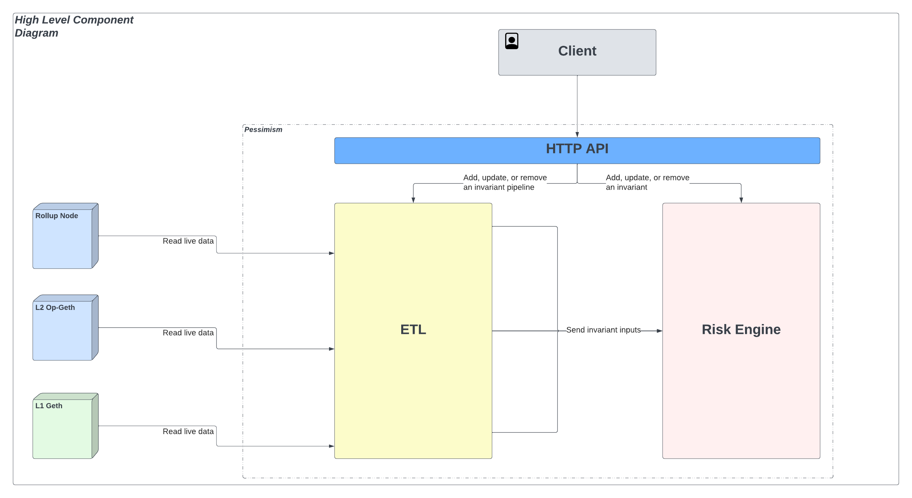

# Pessimism Architecture

There are two subsystems that drive Pessimism’s architecture:
1. [ETL](./ETL.md) - Modularized data extraction system for retrieving and processing external chain data in the form of a DAG known as the Pipeline DAG
2. [Risk Engine](./RISK_ENGINE.md) - Logical execution platform that runs a set of invariants on the data funneled from the Pipeline DAG

These systems will be accessible by a client through the use of a restful HTTP API that has direct access to both primary subsystems.

The API will be supported to allow Pessimism developers to:
1. Deploy arbitrary invariants
2. Run active invariant sessions (Backtest, Live)
3. Remove invariant or invariant sessions

## Diagram

