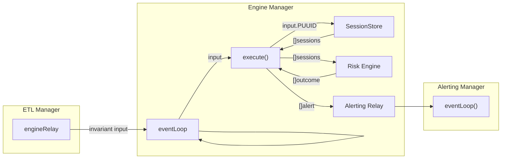

# Risk Engine

## Overview
The risk engine is responsible for handling and executing active invariants. It is the primary downstream consumer of ETL output. The risk engine will receive data from the ETL and execute the invariants associated with the data. If an invalidation occurs, the risk engine will return an `InvalidationOutcome` to the `EngineManager`. The `EngineManager` will then create an `Alert` using the `InvalidationOutcome` and publish it to the Alerting system.

The Risk Engine will execute the invariants associated with some ingested input data and return an `InvalidationOutcome` to the `EngineManager`. The `EngineManager` will then create an `Alert` using the `InvalidationOutcome` and publish it to the Alerting system.

The following diagram further exemplifies this key interaction:



## Inter-Connectivity
The ETL publishes `Invariant Input` to the Risk Engine using a relay channel. The Risk Engine will subscribe to this channel to receive and process updates as they are published by the ETL. The Risk Engine will also publish events to the Alerting system using a separate downstream relay channel. The Alerting system will subscribe to this channel to receive and process updates as they are published by the Risk Engine.

## Invariant Session
An invariant session refers the the execution and representation of a single invariant. An invariant session is uniquely identified by a `SUUID` and is associated with a single `PUUID`. An invariant session is created by the `EngineManager` when a user requests to run an active session. The `EngineManager` will create a new `InvariantSession` and pass it to the `RiskEngine` to be executed. The `RiskEngine` will then execute the invariant session and return an `InvalidationOutcome` to the `EngineManager`. The `EngineManager` will then create an `Alert` using the `InvalidationOutcome` and publish it to the Alerting system.


## Session UUID (SUUID)
The SUUID is a unique identifier that is used to identify a specific invariant session. The SUUID is generated by the `EngineManager` when a user requests to run a new invariant session. The SUUID is used to uniquely identify a specific invariant session. This allows the `EngineManager` to perform operations on a specific invariant session such as removing it or updating it. 

A `SUUID` constitutes of a `UUID` and a `PID`. The `PUUID` is the ID of the invariant that the session is associated with. T

A `SessionPID` is encoded using the following 3 byte array sequence:
```
            0           1           2           3
            |-----------|-----------|-----------|
               Network    Pipeline    Invariant
                Type        Type        Type
```


## Invariant Input
The invariant input is a struct that contains the following fields:
* `PUUID` - The ID of the invariant that the input data is intended for
* `Input` - Transit data that was generated by the ETL

## Invariant
An invariant is a logical execution module that defines some set of invalidation criteria. The invariant is responsible for processing the input data and determining if an invalidation has occured. If an invalidation has occured, the invariant will return a `InvalidationOutcome` that contains relevant metadata necessary for the `EngineManager` to create an `Alert`.

### Addressing
All invariants have a boolean propety `Addressing` which determines if the invariant is addressable. To be addressable, an invariant must only execute under when provided input data specific to a single address.

For example, a `balance_enforcement` invariant session will be addressable because it only executes invalidation logic for the native ETH balance of a single address. 

### Execution Type
A risk engine has an associated execution type that defines how the risk engine will execute the invariant. There are two types of execution:
1. Hardcoded - The invariant invalidation is hardcoded directly into the risk engine
2. Dynamic - The invariant invalidation is dynamically loaded into the risk engine. **As of now, this is not supported.**

## Hardcoded Invariant Types
As of now, there are two types of hardcoded invariants that a user can deploy active sessions for:
-  `invocation` - Invariant that is triggered when a specific function is invoked **Not currently Supported**
- `balance` - Invariant that checks an address's balance changes and ensures that the balance does not exceed a certain threshold

### How to add a new invariant
1. Create a new file in the `internal/engine/registry` directory
3. Add a new entry to the `InvariantType` enum in `internal/core/constants.go`
2. Add a new entry to the registry in `internal/engine/registry/registry.go`

## Dynanmic Invariant Types
**Not currently supported**
Dynamic invariants are invariants that are dynamically loaded into the risk engine. This allows users to deploy custom programmable invariants that are not hardcoded into the risk engine. This is not currently supported.