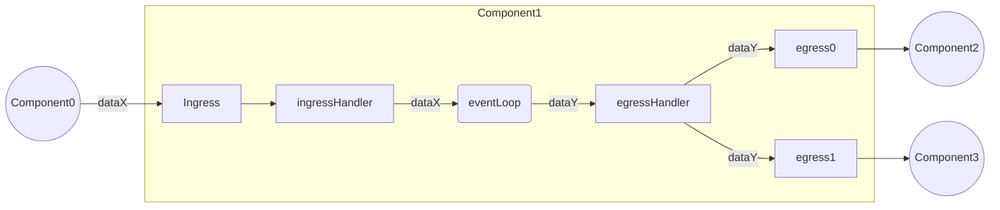
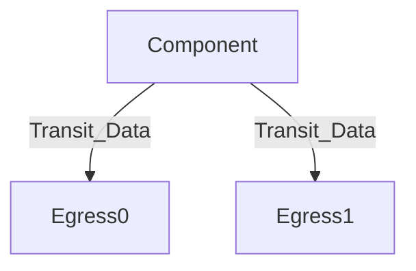
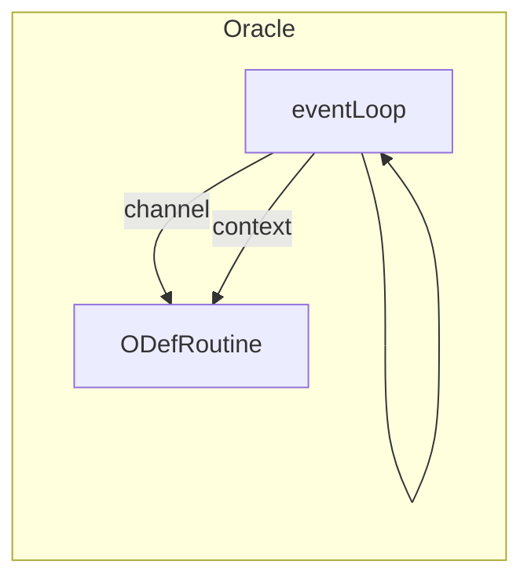

# ETL

The Pessimism ETL is a generalized abstraction for a DAG-based component system that continuously transforms chain data into inputs for consumption by the Risk Engine in the form of intertwined “pipelines”.

## Component
A component refers to a graph node within the ETL system. Every component performs some operation for transforming data from any data source into a consumable input for the Risk Engine to ingest. 
Currently, there are three total component types:
1. `Pipe` - Used to perform local arbitrary computations _(e.g. Extracting L1Withdrawal transactions from a block)_
2. `Oracle` - Used to poll and collect data from some counter-party source _(e.g. Querying real-time account balance amounts)_
3. `Aggregator` - Used to synchronize events between asynchronous data sources _(e.g. Synchronizing L1/L2 blocks to understand real-time changes in bridging TVL)_
 

### Inter-Connectivity 
The diagram below showcases how interactivity between components occurs:

#### Egress Handler
All component types use an `egressHandler` type for routing transit data to actively subscribed downstream ETL components.

#### Ingress Handler
All component types also use an `ingressHandler` type for ingesting active transit data from upstream ETL components.

### UUID
All components have a UUID that stores critical identification data. Component IDs are used by higher order abstractions to:
* Represent a component DAG 
* Understand when component duplicates occur in the system

Component UUID's constitute of both a randomly generated `UUID` and a deterministic `PID`. This is done to ensure uniqueness of each component instance while also ensuring collision based properties so that components can be reused when viable.

### Activity State Channel
All components have an internal activity state to represent their current status of operation. Currently, the only supported values are:
I. _Inactive_ - Refers to a component with no actively running event loop routine.
II. _Live_ - Refers to a component with an actively running event loop routine.
III. _Crashed_ - Refers to a component that's suffered some failure and subsequent `eventLoop` routine death. 

**NOTE - State handling policies by management abstractions has yet to be properly fleshed out**

### Pipe
Pipes are used to perform local arbitrary computations on some input data. Once input data processing has been completed, the output data is then submitted to its respective destination(s). 

#### Attributes
* An `ActivityState` channel with a pipeline manager
* Ingress handler that other components can write to
* `TransformFunc` - A processing function that performs some data translation/transformation on respective inputs
* An egressHandler that stores dependencies to write to (i,e. Other pipeline components, invariant engine)
* A specified output data type

### Oracle 
Oracles are responsible for collecting data from some external third party _(e.g, L1 geth node, L2 rollup node, etc.)_. As of now, oracle's are configurable through the use of a standard `OracleDefinition` interface that allows developers to write arbitrary oracle logic. 
The following key interface functions are supported/enforced:
* `ReadRoutine` - Routine used for reading/polling real-time data for some arbitrarily configured data source
* `BackTestRoutine` - _Optional_ routine used for sequentially backtesting from some starting to ending block heights. 

Unlike other components, `Oracles` actually employ _2 go routines_ to safely operate. This is because the definition routines are run as a separate go routine with a communication channel to the actual `Oracle` event loop. This is visualized below:

#### Attributes
* A communication channel with the pipeline manager
* Poller/subscription logic that performs real-time data reads on some third-party source
* An `egressHandler` that stores dependencies to write to (i.e. Other pipeline components, invariant engine)
* A specified output data type

* _(Optional)_ Interface with some storage (postgres, mongo, etc.) to persist lively extracted data
* _(Optional)_ Backtest support for polling some data between some starting and ending block heights

### (TBD) Aggregator
Aggregators are used to solve the problem where a pipe or an invariant input will require multiple data points to perform an execution sequence. Since aggregators are subscribing to more than one data stream with different output frequencies, they must employ a synchronization policy for collecting and propagating multi-data inputs within a highly asynchronous environment.