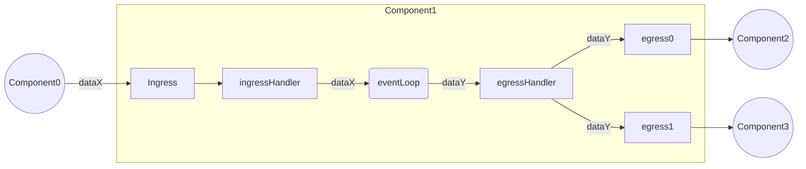
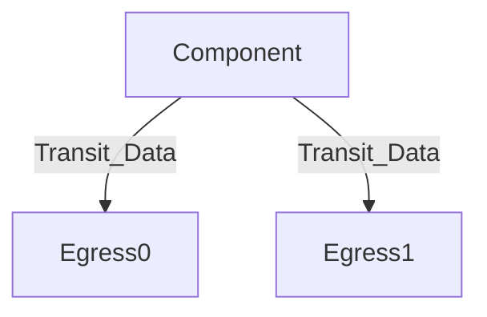
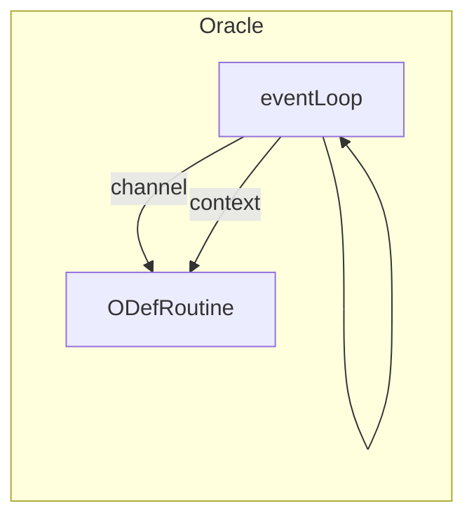
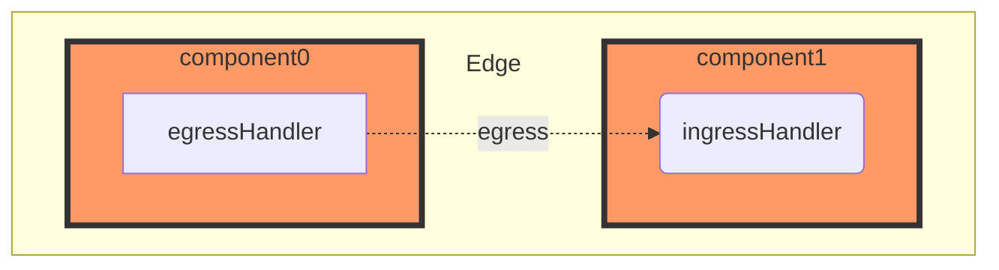

# ETL

The Pessimism ETL is a generalized abstraction for a DAG-based component system that continuously transforms chain data into inputs for consumption by a Risk Engine in the form of intertwined data “pipelines”. This DAG based representation of ETL operations is done to ensure that the application can optimally scale to support many active invariants. This design allows for the reuse of modularized ETL components and de-duplication of conflicting pipelines under certain logical circumstances. 


## Component
A component refers to a graph node within the ETL system. Every component performs some operation for transforming data from any data source into a consumable input for the Risk Engine to ingest. 
Currently, there are three total component types:
1. `Pipe` - Used to perform local arbitrary computations _(e.g. Extracting L1Withdrawal transactions from a block)_
2. `Oracle` - Used to poll and collect data from some counter-party source _(e.g. Querying real-time account balance amounts)_
3. `Aggregator` - Used to synchronize events between asynchronous data sources _(e.g. Synchronizing L1/L2 blocks to understand real-time changes in bridging TVL)_
 

### Inter-Connectivity 
The diagram below showcases how interactivity between components occurs:




#### Egress Handler
All component types use an `egressHandler` struct for routing transit data to actively subscribed downstream ETL components.


#### Ingress Handler
All component types also use an `ingressHandler` struct for ingesting active transit data from upstream ETL components.


### UUID
All components have a UUID that stores critical identification data. Component IDs are used by higher order abstractions to:
* Represent a component DAG 
* Understand when component duplicates occur in the system

Component UUID's constitute of both a randomly generated `UUID` and a deterministic `PID`. This is done to ensure uniqueness of each component instance while also ensuring collision based properties so that components can be reused when viable.

A `ComponentPID` is encoded using the following four byte sequence:
```
            0        1        2        3        4
            |--------|--------|--------|--------|
             network  pipeline component register
             id         type     type      type
```

### Activity State Channel
All components have an internal activity state to represent their current status of operation. Currently, the only supported values are:
I. _Inactive_ - Refers to a component with no actively running event loop routine.
II. _Live_ - Refers to a component with an actively running event loop routine.
III. _Crashed_ - Refers to a component that's suffered some failure and subsequent `eventLoop` routine death. 

**NOTE - State handling policies by management abstractions has yet to be properly fleshed out**


### Pipe
Pipes are used to perform arbitrary transformations on some provided upstream input data. 
Once input data processing has been completed, the output data is then submitted to its respective destination(s). 

#### Attributes
* An `ActivityState` channel with a pipeline manager
* Ingress handler that other components can write to
* `TransformFunc` - A processing function that performs some data translation/transformation on respective inputs
* An `egressHandler` that stores dependencies to write to (i.e. Other pipeline components, invariant engine)
* A specified output data type

#### Example Use Case(s)
* Generating opcode traces for some EVM transaction
* Parsing emitted events from a transaction 

### Oracle 
Oracles are responsible for collecting data from some external third party _(e.g. L1 geth node, L2 rollup node, etc.)_. As of now, oracle's are configurable through the use of a standard `OracleDefinition` interface that allows developers to write arbitrary oracle logic. 
The following key interface functions are supported/enforced:
* `ReadRoutine` - Routine used for reading/polling real-time data for some arbitrarily configured data source
* `BackTestRoutine` - _Optional_ routine used for sequentially backtesting from some starting to ending block heights. 

Unlike other components, `Oracles` actually employ _2 go routines_ to safely operate. This is because the definition routines are run as a separate go routine with a communication channel to the actual `Oracle` event loop. This is visualized below:



#### Attributes
* A communication channel with the pipeline manager
* Poller/subscription logic that performs real-time data reads on some third-party source
* An `egressHandler` that stores dependencies to write to (i.e. Other pipeline components, invariant engine)
* A specified output data type

* _(Optional)_ Interface with some storage (postgres, mongo, etc.) to persist lively extracted data
* _(Optional)_ Backtest support for polling some data between some starting and ending block heights
* _(Optional)_ Use of an application state cache to understand which parameter sets to sequentially feed to an endpoint


#### Example Use Case(s)
* Polling layer-2 block data in real-time for state updates
* Interval polling user provided chain addresses for native ETH amounts

### (TBD) Aggregator
Aggregators are used to solve the problem where a pipe or an invariant input will require multiple data points to perform an execution sequence. Since aggregators are subscribing to more than one data stream with different output frequencies, they must employ a synchronization policy for collecting and propagating multi-data inputs within a highly asynchronous environment.

## Registry
A registry submodule is used to store all ETL data register definitions that provide the blueprint for a unique ETL component type. A register definition consists of:
- `DataType` - The output data type of the component node
- `ComponentType` - The type of component being generated (_ie. Oracle_)
- `ComponentConstructor` - Constructor function used to create unique component instances
 `Dependencies` - Ordered slice of data register dependencies that are necessary 

## Managed ETL Pipeline DAG
### Component Graph
The ETL uses a `ComponentGraph` construct to represent and store critical component inter-connectivity data _(ie. component node entries and graph edges)_.

A graph edge is represented as a binded communication path between two arbitrary component nodes (`c1`, `c2`). Adding an edge from some component (`c1`) to some downstream component (`c2`) results in `c1` having a path to the ingress of `c2` in it's [egress handler](#egress-handler). This would look something like:



It's important to note that the component graph used in the ETL is represented as a _(DAG)_ Directed Acylcic Graph; meaning that no bipartite edge relationships should exist between two components (`c1`, `c2`) where `c1-->c2` && `c2-->c1`. While there are no explicit checks for this in the code software, it should be impossible given that all components declare entrypoint register dependencies within their metadata, meaning that a component could only be susceptible to bipartite connectivity in the circumstance where a component registry definition declares inversal input->output of an existing component. 


### Pipeline
Pipelines are used to represent some full component path in a DAG based `ComponentGraph`. 
Pipelines are also used for spawning concurrent component event loops routines. 

### UUID
All pipelines have a UUID that stores critical identification data. Pipeline UUIDs are used by higher order abstractions to:
* Route invariant inputs between the ETL and Risk Engine
* Understand when pipeline collisions between `PIDs` occur

Pipeline UUID's constitute of both a randomly generated `UUID` and a deterministic `PID`. This is done to ensure uniqueness of each component instance while also ensuring collision based properties so that components can be reused when viable.

A `PipelinePID` is encoded using the following 9 byte array sequence:
```
            0        1                                        5                                        9
            |--------|----------------------------------------|----------------------------------------|
             pipeline             first pipeline path               last pipeline path
             type                 component PID sequence            component PID sequence
```

## Manager
A management abstraction `EtlManager` is used for connecting lower-level objects (_Component Graph, Pipeline_) together in a way to express meaningful ETL administration logic. 

Currently, the `EtlManager` is used to:
- `CreateDataPipeline` - Construct unique data pipelines provided a pipeline config
- `RunPipeline` - Run data pipelines provided a pipeline UUID
- `EventLoop` - Actively process component state changes